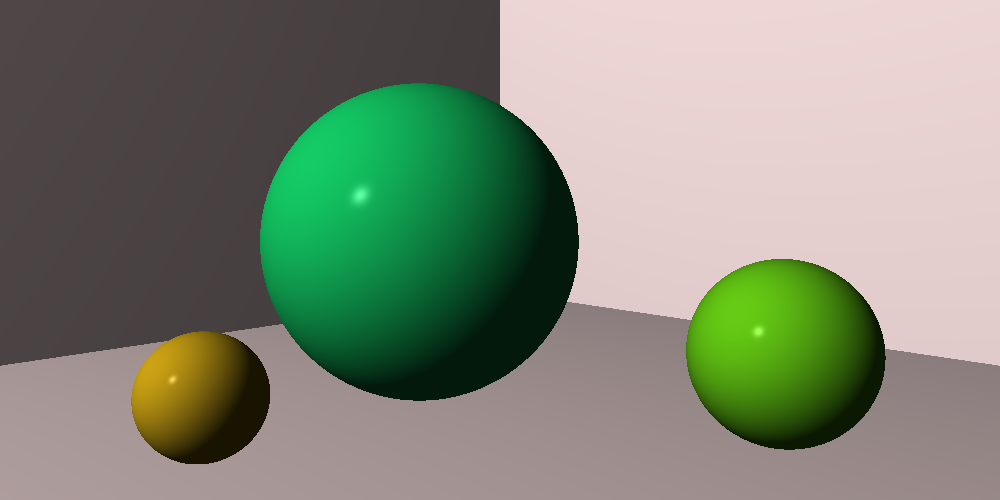
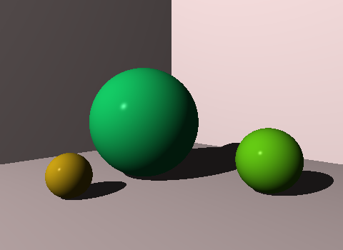

# Compile-Time-RayTracerChallenge (CTRTC)
Ray tracer implementation in C++ inspired by Jamis Buck's book "The Ray Tracer Challenge".

This is a C++20 ray tracer project using constexpr function evaluation to make all computation happend entirely at compile-time.

(This project is currently under development)

# Quick Start 
## Prerequisites
- CMake 3.16+
- GTest
- Compliant C++20 compiler
  - The library is sytematically tested on following compilers 

Compiler | Version
---------|--------
GCC      | 12.1.0
clang    | 14.0.0

With Ubuntu 22.04(the O.S I used), one could easily install and setup enviorments needed for this project by:
```bash
# Install Make/CMake
sudo apt-get install -y build-essential
sudo apt-get install -y cmake
# Install GTest for running test suite
sudo apt-get install -y libgtest-dev
# Install g++20 and setup  
sudo apt-get install -y g++-12 gcc-12
sudo update-alternatives --install /usr/bin/gcc gcc /usr/bin/gcc-12 100 --slave /usr/bin/g++ g++ /usr/bin/g++-12 --slave /usr/bin/gcov gcov /usr/bin/gcov-12
# (optional) or install clang14 if you want
sudo apt-get install -y clang-14
sudo update-alternatives --install /usr/bin/c++ c++ /usr/bin/clang++-14 40
```

**WARNING**

While compile-time image generation works with GCC 12, compiler memory usage is **extreme** -- tens of gigabytes for even modest image sizes. If you want to try it out with GCC, stick to very small images or prepare for violent retribution from the OOM-killer.


## Build and run test suite
Use the following commands from the project's top-most directory to run the test suite.
```bash
cd CTRTC
make clean # for tidy check
make test=1
make run-test
```
## Render Results (starting from chapter 5)
If you want to complete the render at compile time, all calculations have to be done at compile time, which will cost a lot of memory and take longer to compile.
<details><summary>Chapter5</summary>
<p>

```bash
cd CTRTC
make clean # for tidy check
make CH=5 # render at run time
# ---or render at compile time, this would take up ~30 min to finish ---#
make CH=5 STATIC=1 
./build/default/debug/scene/CHAPTER5 
```

[]

</p>
</details>

<details><summary>Chapter6</summary>
<p>

```bash
cd CTRTC
make clean # for tidy check
make CH=6 # render at run time
# ---or render at compile time, this would take up ~30 min to finish
make CH=6 STATIC=1 
./build/default/debug/scene/CHAPTER6
```


  
  
</p>
</details>

<details><summary>Chapter7</summary>
<p>

```bash
cd CTRTC
make clean # for tidy check
make CH=7 # render at run time
# ---or render at compile time, this would take up ~30 min to finish
make CH=7 STATIC=1 
./build/default/debug/scene/CHAPTER7
```


  
  
</p>
</details>

<details><summary>Chapter8</summary>
<p>

```bash
cd CTRTC
make clean # for tidy check
make CH=8 # render at run time
# ---or render at compile time, this would take up ~30 min to finish
make CH=8 STATIC=1 
./build/default/debug/scene/CHAPTER8
```


  
  
</p>
</details>