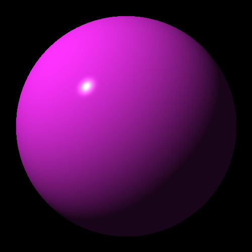

# RayTracerChallenge
Ray tracer implementation in C++ inspired by Jamis Buck's book "The Ray Tracer Challenge" 

I tring to make whole project to be able to run at compile time.

(This project is currently under development)

# Quick Start 
## Prerequisites
- CMake 3.16+
- GTest
- Compliant C++20 compiler
  - The library is sytematically tested on following compilers 

Compiler | Version
---------|--------
GCC      | 12.1.0
clang    | 13.0.0

## Build and run test suite
Use the following commands from the project's top-most directory to run the test suite.
```bash
cd RayTracerChallenge
make test=1 # or make TEST=1
make run-test
```
## Render Results (starting from chapter 5)
If you want to complete the render at compile time, all calculations have to be done at compile time, which will cost a lot of memory and take longer to compile.
<details><summary>Chapter5</summary>
<p>

```bash
cd RayTracerChallenge
make CH=5 # render at run time
# ---or render at compile time, this would take up ~30 min to finish ---#
make CH=5 STATIC=1 
./build/default/debug/scene/CHAPTER5 
```

[]

</p>
</details>

<details><summary>Chapter6</summary>
<p>

```bash
cd RayTracerChallenge
make CH=6 # render at run time
# or render at compile time, this would take up ~15 min to finish
make CH=6 STATIC=1 
./build/default/debug/scene/CHAPTER6
```


  
  
</p>
</details>